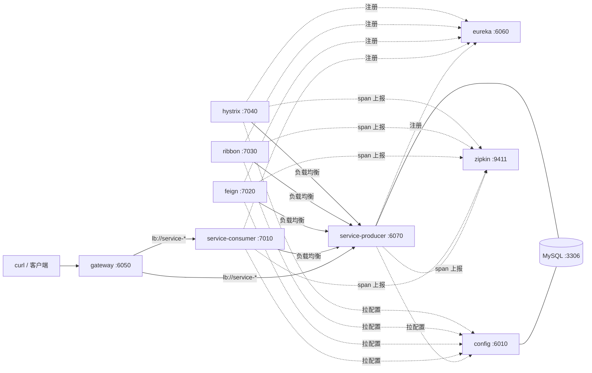

# Spring-Cloud

一套**可完整运行**的 Spring Cloud 微服务教学样例，配套博文系列：

- 简书地址：https://www.jianshu.com/u/b090c5948b38
- 博客地址：https://wkedong.github.io/
- 配套教程（仓库内 docs/，基于当前 develop 分支）：
  - [00 · 项目总览](docs/00-项目总览.md)
  - [01 · 服务注册与发现](docs/01-服务注册与发现.md)
  - [02 · 配置中心](docs/02-配置中心.md)
  - [03 · 服务消费](docs/03-服务消费.md)
  - [04 · 声明式调用 Feign](docs/04-声明式调用Feign.md)
  - [05 · 服务容错保护](docs/05-服务容错保护.md)
  - [06 · 服务网关](docs/06-服务网关.md)
  - [07 · 服务追踪](docs/07-服务追踪.md)
  - [08 · 升级迁移指南](docs/08-升级迁移指南.md)（Edgware → 2021.0 全量对照）
  - [09 · 本地运行指南](docs/09-本地运行指南.md)

## 分支说明

| 分支 | 版本 | 说明 |
| --- | --- | --- |
| `master` | Spring Boot 1.5.2 · Spring Cloud Edgware.SR5 · Java 8 | 2019 年原版，与早期博客一一对应 |
| `develop` | Spring Boot 2.7.18 · Spring Cloud 2021.0.9 · Java 8 | 现代化升级版，组件按官方映射替换 |

学习建议：先在 develop 分支按 docs/ 学现代写法；想理解「为什么这么写」或维护老系统时，
对照 master 分支的同名模块——两分支的模块目录、业务代码接口完全同构。

## 模块与版本矩阵（develop 分支）

| 模块（目录） | 端口 | 教学主题 | 关键组件（2021.0） |
| --- | --- | --- | --- |
| `eureka` | 6060 | 服务注册与发现 | Eureka Server |
| `config` | 6010 | 配置中心（JDBC 后端） | Config Server + Flyway 8.5 |
| `zuul` | 6050 | 服务网关（目录名保留自博客系列） | **Spring Cloud Gateway**（Zuul 已退役） |
| `service-producer` | 6070 | 服务提供者 | MyBatis 2.3 + MySQL 8 |
| `service-consumer` | 7010 | 服务消费 | RestTemplate + **LoadBalancer** |
| `service-consumer-feign` | 7020 | 声明式调用 + multipart 透传 | **OpenFeign** |
| `service-consumer-ribbon` | 7030 | 负载均衡消费（目录名保留自博客系列） | **LoadBalancer**（Ribbon 已退役） |
| `service-consumer-ribbon-hystrix` | 7040 | 熔断降级（目录名保留自博客系列） | **Resilience4j**（Hystrix 已退役） |
| （docker-compose） | 9411 | 链路追踪 | Sleuth 3.1 + 官方 Zipkin 3 |

> 三个目录名保留 `zuul`/`ribbon`/`hystrix` 字样是为了对应原博客标题；
> 实现已全部替换为官方继任组件，逐条对照见 [08-升级迁移指南](docs/08-升级迁移指南.md)。

## 快速开始

```bash
# 1) 基础设施（MySQL + Zipkin）
docker compose up -d

# 2) 构建
mvn clean package -DskipTests

# 3) 按依赖顺序启动（详细步骤与逐项验证见 docs/09）
java -jar eureka/target/eureka-0.0.1-SNAPSHOT.jar
java -jar config/target/config-0.0.1-SNAPSHOT.jar
java -jar service-producer/target/service-producer-0.0.1-SNAPSHOT.jar --server.port=6070
java -jar service-consumer/target/service-consumer-0.0.1-SNAPSHOT.jar
java -jar zuul/target/zuul-0.0.1-SNAPSHOT.jar

# 4) 验证
curl http://localhost:6050/service-consumer/testGet
# → Hello, Spring Cloud! My port is 6070 Get info is testGet Success
```

## 服务拓扑



## 端口规划

| 端口 | 服务 | | 端口 | 服务 |
| --- | --- | --- | --- | --- |
| 6010 | config | | 7010 | service-consumer |
| 6050 | gateway | | 7020 | service-consumer-feign |
| 6060 | eureka | | 7030 | service-consumer-ribbon |
| 6070+ | service-producer | | 7040 | service-consumer-ribbon-hystrix |
| 9411 | zipkin | | 3306 | mysql |
