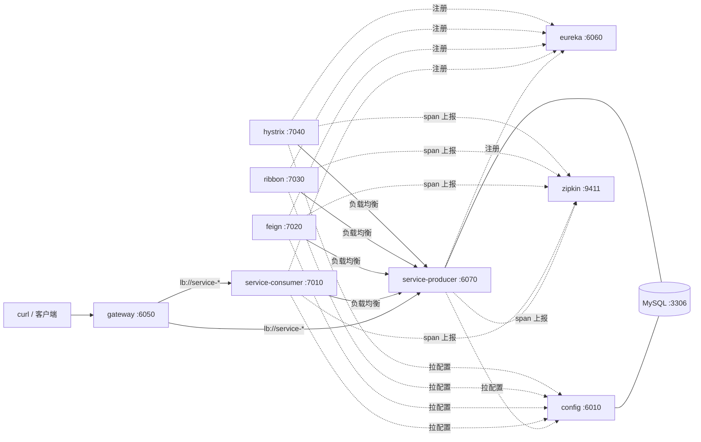

# Spring-Cloud

一套**可完整运行**的 Spring Cloud 微服务教学项目：9 个模块覆盖注册中心、配置中心、服务消费、
声明式调用、容错保护、服务网关、链路追踪，全部代码与配置在本仓库自包含，
**每讲都带「动手验证」命令**，可直接对照运行结果学习。

技术栈：Spring Boot 2.7.18 · Spring Cloud 2021.0.9 · Java 8。

## 教学文档（仓库内 docs/，学习主线）

| 阶段 | 文档 | 主题 | 配套模块 |
| --- | --- | --- | --- |
| ① 基础设施 | [00 · 项目总览](docs/00-项目总览.md) | 整体架构、模块职责、服务拓扑 | — |
| | [01 · 服务注册与发现](docs/01-服务注册与发现.md) | Eureka：谁在线、在哪里 | `eureka` |
| | [02 · 配置中心](docs/02-配置中心.md) | Config Server（JDBC 后端）+ Flyway | `config` |
| ② 服务间调用 | [03 · 服务消费](docs/03-服务消费.md) | `@LoadBalanced` RestTemplate + 负载均衡 | `service-consumer(-ribbon)` |
| | [04 · 声明式调用 Feign](docs/04-声明式调用Feign.md) | OpenFeign、multipart 文件透传 | `service-consumer-feign` |
| | [05 · 服务容错保护](docs/05-服务容错保护.md) | Resilience4j 熔断 + 降级 fallback | `service-consumer-ribbon-hystrix` |
| ③ 入口与观测 | [06 · 服务网关](docs/06-服务网关.md) | Spring Cloud Gateway 路由 | `zuul` |
| | [07 · 服务追踪](docs/07-服务追踪.md) | Sleuth 3.1 + 官方 Zipkin | 各业务模块 |
| ④ 工程实践 | [08 · 升级迁移指南](docs/08-升级迁移指南.md) | Edgware → 2021.0 新旧全量对照 | 全部 |
| | [09 · 本地运行指南](docs/09-本地运行指南.md) | 启动顺序、12 项验证清单、常见问题 | 全部 |

每篇文档结构统一：**学什么 → 核心代码 → 版本变化 → 动手验证 → 思考点**。
看代码前先读 00，动手前先读 09。

## 分支说明

| 分支 | 版本 | 说明 |
| --- | --- | --- |
| `develop` | Spring Boot 2.7.18 · Spring Cloud 2021.0.9 · Java 8 | **主分支，现代写法**，与 docs/ 教学文档一一对应 |
| `master` | Spring Boot 1.5.2 · Spring Cloud Edgware.SR5 · Java 8 | 2019 年旧版实现，作为**新旧对照基线** |

两个分支的**模块目录名、业务代码接口完全同构**，因此可以逐文件对比：
同一功能在旧栈/新栈分别怎么写，差异一目了然（差异清单见 docs/08）。
部分目录名带历史字样（`zuul`/`ribbon`/`hystrix`），正是为了让两分支能路径对路径地比较。

## 模块与版本矩阵（develop 分支）

| 模块（目录） | 端口 | 教学主题 | 关键组件（2021.0） |
| --- | --- | --- | --- |
| `eureka` | 6060 | 服务注册与发现 | Eureka Server |
| `config` | 6010 | 配置中心（JDBC 后端） | Config Server + Flyway 8.5 |
| `zuul` | 6050 | 服务网关（目录名为历史名） | **Spring Cloud Gateway**（Zuul 已退役） |
| `service-producer` | 6070 | 服务提供者 | MyBatis 2.3 + MySQL 8 |
| `service-consumer` | 7010 | 服务消费 | RestTemplate + **LoadBalancer** |
| `service-consumer-feign` | 7020 | 声明式调用 + multipart 透传 | **OpenFeign** |
| `service-consumer-ribbon` | 7030 | 负载均衡消费（目录名为历史名） | **LoadBalancer**（Ribbon 已退役） |
| `service-consumer-ribbon-hystrix` | 7040 | 熔断降级（目录名为历史名） | **Resilience4j**（Hystrix 已退役） |
| （docker-compose） | 9411 | 链路追踪 | Sleuth 3.1 + 官方 Zipkin 3 |

## 服务拓扑



## 快速开始

```bash
# 1) 基础设施（MySQL + Zipkin）
docker compose up -d

# 2) 构建
mvn clean package -DskipTests

# 3) 按依赖顺序启动（完整步骤见 docs/09）
java -jar eureka/target/eureka-0.0.1-SNAPSHOT.jar
java -jar config/target/config-0.0.1-SNAPSHOT.jar
java -jar service-producer/target/service-producer-0.0.1-SNAPSHOT.jar --server.port=6070
java -jar service-consumer/target/service-consumer-0.0.1-SNAPSHOT.jar
java -jar zuul/target/zuul-0.0.1-SNAPSHOT.jar

# 4) 验证
curl http://localhost:6050/service-consumer/testGet
# → Hello, Spring Cloud! My port is 6070 Get info is testGet Success
```

> 提示：服务刚启动时注册表需要 30~60 秒收敛（Eureka 服务端只读缓存 + 客户端拉取间隔），
> 期间调用可能返回 `No servers available` / 网关 503，属正常现象。

## 端口规划

| 端口 | 服务 | | 端口 | 服务 |
| --- | --- | --- | --- | --- |
| 6010 | config | | 7010 | service-consumer |
| 6050 | gateway | | 7020 | service-consumer-feign |
| 6060 | eureka | | 7030 | service-consumer-ribbon |
| 6070+ | service-producer | | 7040 | service-consumer-ribbon-hystrix |
| 9411 | zipkin | | 3306 | mysql |
