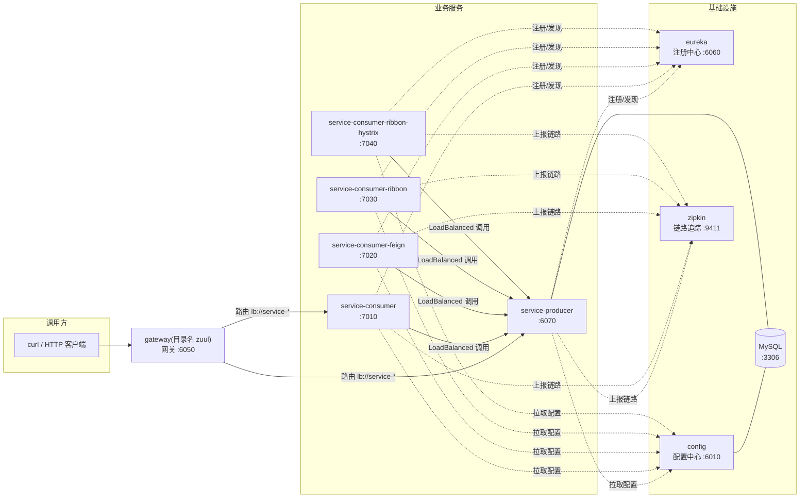

# 00 · 项目总览

一套**可完整运行**的 Spring Cloud 微服务教学样例：Spring Boot 4.0.8 +
Spring Cloud 2025.1.3 + Spring Cloud Alibaba 2025.1.0.0，14 个模块、31 篇文档，
既有 Edgware → 2021.0 → 2025.1 的完整演进记录（见 [08](08-升级迁移指南.md)），也覆盖
Spring Boot 本体深化、新一代组件栈（Nacos / Sentinel / Stream / Security / Seata）
与工程化运维（可观测、容器化、CI/CD）。

## 课程地图（31 篇）

| 阶段 | 文档 | 你会得到什么 |
| --- | --- | --- |
| 一 · 核心链路 | [01](01-服务注册与发现.md)~[09](09-本地运行指南.md) | 注册/配置/消费/容错/网关/追踪六件事跑通，并知道每一步的验证命令 |
| 二 · Boot 本体 | [10](10-Web层工程化.md)~[16](16-测试策略.md) | 统一响应与异常、配置体系、事务与自调用、缓存异步定时任务、Actuator、自定义 Starter、测试策略 |
| 三 · Cloud 组件进阶 | [17](17-Feign进阶.md)~[21](21-配置刷新与链路追踪进阶.md) | Feign 拦截器/日志/错误解码/超时重试、灰度负载均衡、Gateway 鉴权限流、Resilience4j 全家桶、配置刷新与自定义 span |
| 四 · 新一代组件栈 | [22](22-SpringSecurity与JWT.md)~[26](26-分布式事务Seata.md) | JWT 认证授权、Sentinel 流控降级、Nacos 注册配置一体、Stream 消息驱动与 DLQ、Seata AT 分布式事务 |
| 五 · 工程化运维 | [27](27-指标监控与Grafana.md)~[30](30-CICD与工程化收尾.md) | Micrometer+Prometheus+Grafana、日志聚合、分层镜像与 compose、CI 流水线 |

每个阶段都能独立选读：阶段二~五的模块互不依赖，端口不冲突，可单独 `mvn -pl <模块> -am package` 后启动（见 [09](09-本地运行指南.md) 的运行矩阵）。

## 微服务拓扑

## 模块一览

| 模块（目录） | 端口 | 教学主题 | 升级关键变化 |
| --- | --- | --- | --- |
| `eureka` | 6060 | 服务注册与发现 | starter 更名 `netflix-eureka-server` |
| `config` | 6010 | 配置中心（JDBC 后端 + Flyway） | Flyway 11.14.1、mysql-connector-j 9.7.0 |
| `zuul`（实现为 Gateway） | 6050 | 服务网关 | Zuul → Spring Cloud Gateway（WebFlux，目录名为历史名）；2025.1 起 starter 更名 `gateway-server-webflux`、配置前缀下移到 `spring.cloud.gateway.server.webflux.*` |
| `service-producer` | 6070 | 服务提供者（MyBatis + fastjson2） | mybatis-spring-boot-starter 4.1.0、`spring.config.import` 取代 bootstrap |
| `service-consumer` | 7010 | 服务消费（RestTemplate + multipart 转发） | Ribbon → LoadBalancer |
| `service-consumer-feign` | 7020 | 声明式调用 Feign + multipart 透传 | OpenFeign 5.0.3 + feign-form 13.6.1（已并入 `io.github.openfeign` 主仓库坐标，旧 `io.github.openfeign.form:3.8.0` 已移除） |
| `service-consumer-ribbon` | 7030 | 负载均衡消费 | 目录名为历史名，实现换 LoadBalancer |
| `service-consumer-ribbon-hystrix` | 7040 | 熔断降级 | Hystrix → Resilience4j |
| ~~`zipkin`~~ | 9411 | 链路追踪 | 自建模块删除 → 官方独立 Zipkin |
| `springboot-basics` | 8010 | Boot 本体：Web/配置/数据/缓存/Actuator/测试 | 新增（H2 内存库，无外部依赖） |
| `basics-audit-spring-boot-starter` | — | 自动配置与自定义 Starter | 新增（被 springboot-basics 依赖） |
| `nacos-demo` | 8210 / 8211 | Nacos 注册 + 配置一体 | 新增（Spring Cloud Alibaba 2025.1.0.0） |
| `sentinel-demo` | 8220 | Sentinel 流控与熔断降级 | 新增 |
| `stream-demo` | 8230 | Spring Cloud Stream（Kafka Binder） | 新增 |
| `security-demo` | 8240 | Spring Security 7 + JWT | 新增 |
| `seata-demo/seata-order`·`seata-inventory` | 8250 / 8260 | Seata AT 分布式事务 | 新增（Seata 2.5.0 Apache 版，TC 端口 8091） |

## 学习路径建议

1. 先读 [01-服务注册与发现](01-服务注册与发现.md) 理解注册中心；
2. 依次 [02-配置中心](02-配置中心.md)、[03-服务消费](03-服务消费.md)、[04-声明式调用Feign](04-声明式调用Feign.md)；
3. 重点读 [05-服务容错保护](05-服务容错保护.md)（Hystrix→Resilience4j 对照，升级教学价值最高）；
4. [06-服务网关](06-服务网关.md)、[07-服务追踪](07-服务追踪.md) 收尾；
5. 全程配合 [09-本地运行指南](09-本地运行指南.md) 动手验证；想看每一步「为什么这么改」读 [08-升级迁移指南](08-升级迁移指南.md)。

## 调用关系与验证入口

| 验证什么 | 入口 |
| --- | --- |
| 网关路由（自动发现路由） | `GET http://localhost:6050/service-consumer/testGet` |
| 网关路由（显式前缀路由） | `GET http://localhost:6050/api/producer/testGet` |
| RestTemplate 负载均衡 | `GET http://localhost:7010/testGet` |
| Feign 声明式调用 | `GET http://localhost:7020/testFeign` |
| Feign multipart 透传 | `POST http://localhost:7020/testFeignFile`（multipart file） |
| 熔断降级 | `GET http://localhost:7040/testHystrix`（producer 睡 5s，3s 超时触发 fallback） |
| 熔断指标 | `GET http://localhost:7040/actuator/circuitbreakers` |
| 配置中心生效 | `GET http://localhost:6070/testConfig` → 返回 `test-dev-develop` |
| 链路追踪 | Zipkin UI `http://localhost:9411`（调用任意接口后查询） |
