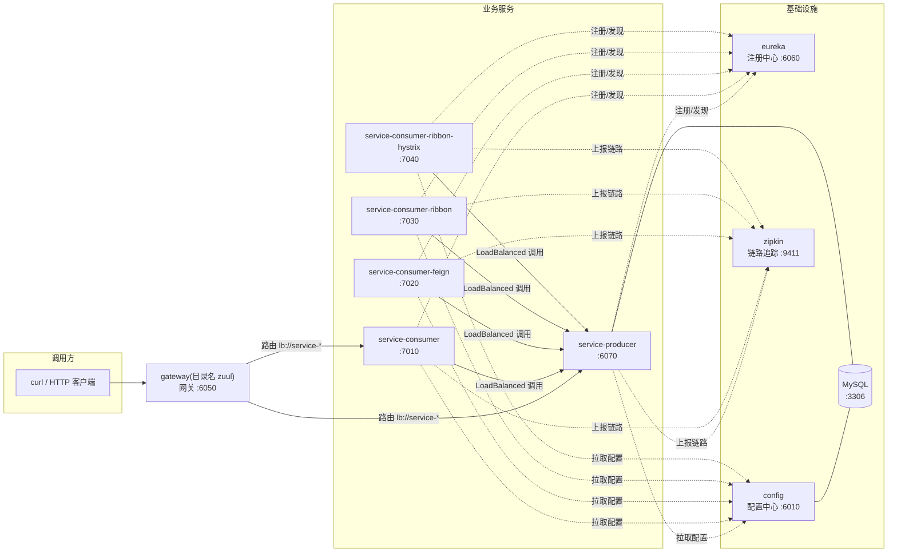

# 00 · 项目总览

一套**可完整运行**的 Spring Cloud 微服务教学样例：Spring Boot 2.7.18 +
Spring Cloud 2021.0.9，含 9 个模块的完整演进（Edgware → 2021.0 的改动逐项记录在 [08](08-升级迁移指南.md)）。

## 微服务拓扑

## 模块一览

| 模块（目录） | 端口 | 教学主题 | 2021.0 关键变化 |
| --- | --- | --- | --- |
| `eureka` | 6060 | 服务注册与发现 | starter 更名 `netflix-eureka-server` |
| `config` | 6010 | 配置中心（JDBC 后端 + Flyway） | Flyway 8.5、MySQL 驱动 8 |
| `zuul`（实现为 Gateway） | 6050 | 服务网关 | Zuul → Spring Cloud Gateway（WebFlux，目录名为历史名） |
| `service-producer` | 6070 | 服务提供者（MyBatis + fastjson） | mybatis starter 2.3、bootstrap starter |
| `service-consumer` | 7010 | 服务消费（RestTemplate + multipart 转发） | Ribbon → LoadBalancer |
| `service-consumer-feign` | 7020 | 声明式调用 Feign + multipart 透传 | OpenFeign + feign-form 3.8 |
| `service-consumer-ribbon` | 7030 | 负载均衡消费 | 目录名为历史名，实现换 LoadBalancer |
| `service-consumer-ribbon-hystrix` | 7040 | 熔断降级 | Hystrix → Resilience4j |
| ~~`zipkin`~~ | 9411 | 链路追踪 | 自建模块删除 → 官方独立 Zipkin |

## 学习路径建议

1. 先读 [01-服务注册与发现](01-服务注册与发现.md) 理解注册中心；
2. 依次 [02-配置中心](02-配置中心.md)、[03-服务消费](03-服务消费.md)、[04-声明式调用Feign](04-声明式调用Feign.md)；
3. 重点读 [05-服务容错保护](05-服务容错保护.md)（Hystrix→Resilience4j 对照，升级教学价值最高）；
4. [06-服务网关](06-服务网关.md)、[07-服务追踪](07-服务追踪.md) 收尾；
5. 全程配合 [09-本地运行指南](09-本地运行指南.md) 动手验证；想看每一步「为什么这么改」读 [08-升级迁移指南](08-升级迁移指南.md)。

## 调用关系与验证入口

| 验证什么 | 入口 |
| --- | --- |
| 网关路由（自动发现路由） | `GET http://localhost:6050/service-consumer/testGet` |
| 网关路由（显式前缀路由） | `GET http://localhost:6050/api/producer/testGet` |
| RestTemplate 负载均衡 | `GET http://localhost:7010/testGet` |
| Feign 声明式调用 | `GET http://localhost:7020/testFeign` |
| Feign multipart 透传 | `POST http://localhost:7020/testFeignFile`（multipart file） |
| 熔断降级 | `GET http://localhost:7040/testHystrix`（producer 睡 5s，3s 超时触发 fallback） |
| 熔断指标 | `GET http://localhost:7040/actuator/circuitbreakers` |
| 配置中心生效 | `GET http://localhost:6070/testConfig` → 返回 `test-dev-develop` |
| 链路追踪 | Zipkin UI `http://localhost:9411`（调用任意接口后查询） |
